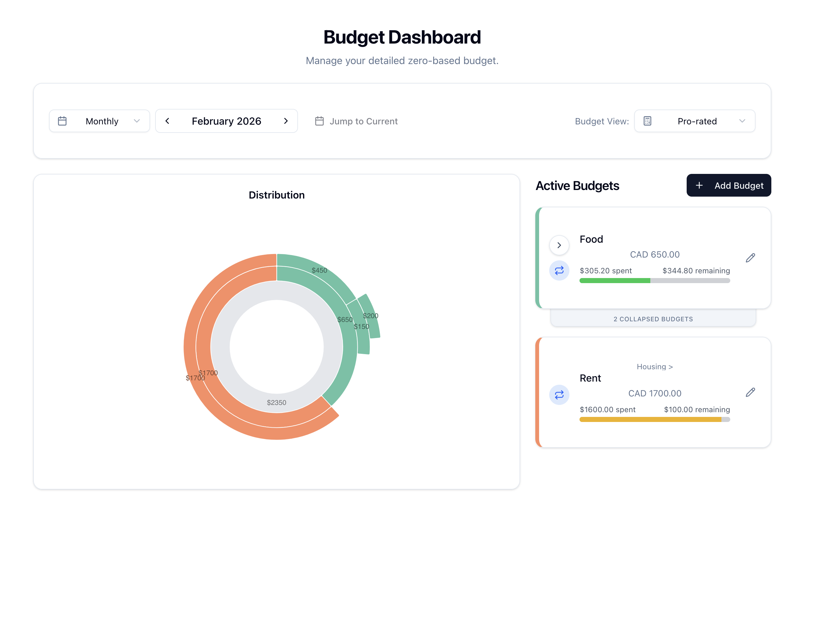
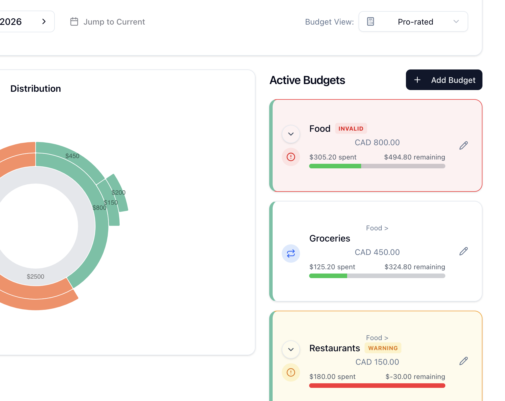
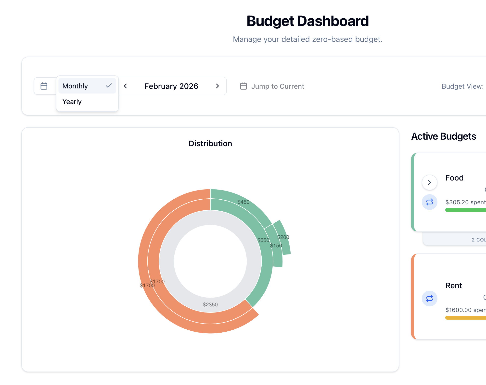

<div align="center">

<br/>

**Track spending · Visualize your budget — all backed by plain-text accounting.**

[](backend/LICENSE)
[](LICENSE-FRONTEND)

</div>

---

### ✨ Features at a Glance

#### 📊 Budget Dashboard
Interactive sunburst chart showing budget distribution, and a list of budgets with progress bars.



---

#### ➕ Create Budgets
Set up recurring (monthly/yearly) or one-off budgets with account search, amount, frequency, and tags.


---

#### ⚠️ Smart Validation
Hierarchical budget validation catches conflicts. See which budgets conflict with which and by what amount.



---

#### 📅 Period Controls
Switch between monthly, and yearly views with pro-rated or full amount display modes.



## How Budgets Are Stored

BagelCount stores budgets as **Beancount `custom` directives** in a dedicated file (`budgets.beancount`) that lives alongside your main ledger. The app never modifies existing transactions — it only appends new budget directives to this file.

### Directive format

```beancount
YYYY-MM-DD custom "budget" Account:Name Amount CURRENCY
  frequency: "monthly"
  start_date: "2024-01-01"
  created_at: "1704067200"
  tags: "essential,fixed"
```

### Fields & metadata

| Field | Location | Required | Description |
|-------|----------|----------|-------------|
| **Date** | Directive line | Yes | Date the directive was created (set automatically to today) |
| **Account** | Directive line | Yes | Beancount expense account (e.g. `Expenses:Food:Groceries`) |
| **Amount** | Directive line | Yes | Budget amount as a decimal |
| **Currency** | Directive line | Yes | Currency code (e.g. `USD`, `CAD`) |
| `start_date` | Metadata | Yes | When the budget takes effect (`YYYY-MM-DD`) |
| `created_at` | Metadata | Yes | Unix timestamp — used to resolve conflicts (latest wins) |
| `frequency` | Metadata | For recurring | One of `monthly`, `quarterly`, or `yearly` |
| `end_date` | Metadata | For custom range | End date for a fixed-period budget (used instead of `frequency`) |
| `tags` | Metadata | No | Comma-separated labels (e.g. `essential`, `goals`) |

A budget is either a **Standard Budget** (has `frequency`) or a **Custom Budget** (has `end_date`). When multiple directives exist for the same account, start date, and frequency, the one with the latest `created_at` wins.

### Ledger setup requirement

Your main beancount file **must** include the budget file. Add this line to your ledger:

```beancount
include "budgets.beancount"
```

NOTE: bagelcount does not yet check if the directive is included.

### Example `budgets.beancount`

```beancount
2024-01-01 custom "budget" Expenses:Food 800.00 CAD
  frequency: "monthly"
  start_date: "2024-01-01"
  created_at: "1704067200"
  tags: "essential"

2024-01-01 custom "budget" Expenses:Travel 3000.00 CAD
  frequency: "yearly"
  start_date: "2024-01-01"
  created_at: "1704067202"
  tags: "goals"
```

## Prerequisites

| Tool | Version | Purpose |
|------|---------|---------|
| [Node.js](https://nodejs.org/) | 24+ | Frontend build & dev server |
| [uv](https://docs.astral.sh/uv/) | 0.7+ | Python package management |
| [Python](https://www.python.org/) | 3.12+ | Backend runtime |
| [Docker](https://www.docker.com/) | 27+ | Containerized deployment (optional) |

## Quick Start (Local Development)

### 1. Clone & install dependencies

```bash
git clone <repo-url> && cd bagelcount

# Frontend
npm install

# Backend
cd backend && uv sync && cd ..
```

### 2. Configure environment

The backend needs to know where your Beancount ledger lives. Set these environment variables (or create a `.env` file in the `backend/` directory):

```bash
export BEANCOUNT_FILE=/path/to/your/main.beancount
export BUDGET_FILE=/path/to/your/budgets.beancount
```

### 3. Generate the API client

The frontend uses a TypeScript client auto-generated from the backend's OpenAPI spec. Generate it once (and again whenever the API changes):

```bash
npm run gen:api
```

This runs two steps:
- `gen:api:json` — exports the OpenAPI schema from FastAPI to `backend/openapi.json`
- `gen:api:ts` — generates the TypeScript client in `src/lib/api/`

### 4. Start the backend

```bash
cd backend
uv run uvicorn app.main:app --reload
```

The API will be available at `http://localhost:8000`. Health check: `http://localhost:8000/health`.

### 5. Start the frontend

```bash
npm run dev
```

Opens at `http://localhost:5173`. The Vite dev server proxies `/api/*` requests to the backend automatically.

## Docker

### 1. Create a `.env` file in the project root

```bash
cp .env.example .env
```

Edit `.env` with your actual paths:

```env
BEANCOUNT_DIR=/absolute/path/to/your/ledger/directory
BEANCOUNT_FILE_NAME=main.beancount
```

Both variables are **required** — Docker Compose will fail with an error if they are missing.

### 2. Build and run

```bash
docker compose up --build
```

| Service | URL | Description |
|---------|-----|-------------|
| Frontend | `http://localhost:3000` | Nginx serving the React app |
| Backend | `http://localhost:8000` | FastAPI (also accessible directly) |

The frontend Nginx container proxies `/api/*` requests to the backend. Your ledger directory is mounted **read-only** into the backend container.

### 3. Stop

```bash
docker compose down
```

## Available Scripts

### Frontend (npm)

| Command | Description |
|---------|-------------|
| `npm run dev` | Start Vite dev server with HMR |
| `npm run build` | Generate API client + TypeScript check + production build |
| `npm run preview` | Preview production build locally |
| `npm run gen:api` | Regenerate API client (JSON export + TypeScript generation) |
| `npm run gen:api:ts` | Regenerate TypeScript client only (from existing `openapi.json`) |
| `npm run test` | Run frontend (Vitest) and backend (pytest) tests |
| `npm run test:ui` | Open Vitest UI |
| `npm run lint` | Run ruff (Python) + ESLint (TypeScript) |

### Backend (uv)

| Command | Description |
|---------|-------------|
| `uv run uvicorn app.main:app --reload` | Start dev server with hot reload |
| `uv run pytest` | Run backend tests |
| `uv run ruff check .` | Lint Python code |

## Architecture

```
Browser ──► Nginx (:3000) ──► Static React App
                │
                └──► /api/* ──► FastAPI (:8000) ──► Beancount Files
```

- **Frontend:** React 19, Vite 7, TypeScript 5.9, Tailwind CSS 4, shadcn/ui, Nivo charts
- **Backend:** Python 3.12, FastAPI, Pydantic Settings, beancount library
- **API Contract:** OpenAPI spec auto-generated from FastAPI, consumed by `@hey-api/openapi-ts`
- **Containerization:** Docker Compose, multi-stage builds, non-root containers, read-only filesystems

## Licence
This project contains components under different licenses:

- backend/  (see backend/LICENSE)
- All other files → MIT (see LICENSE-FRONTEND)